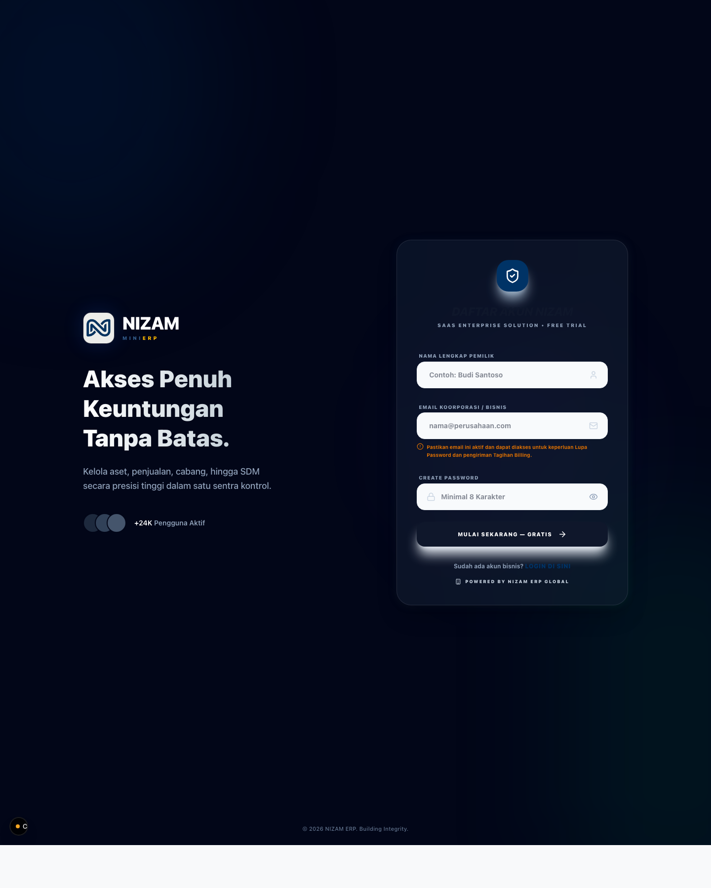
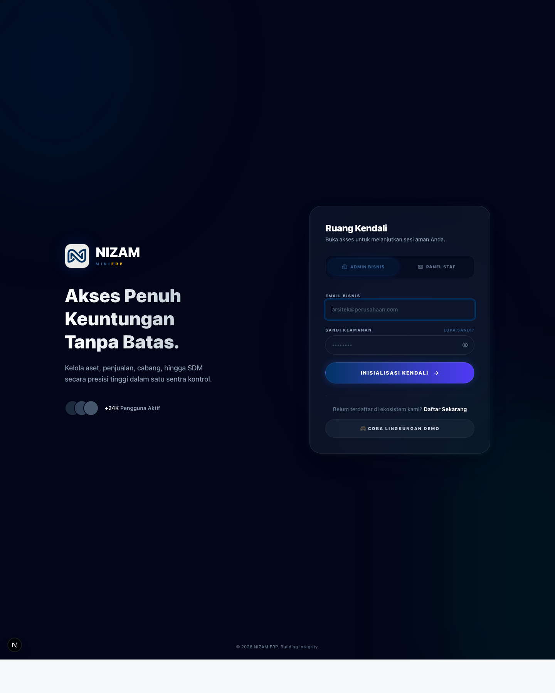
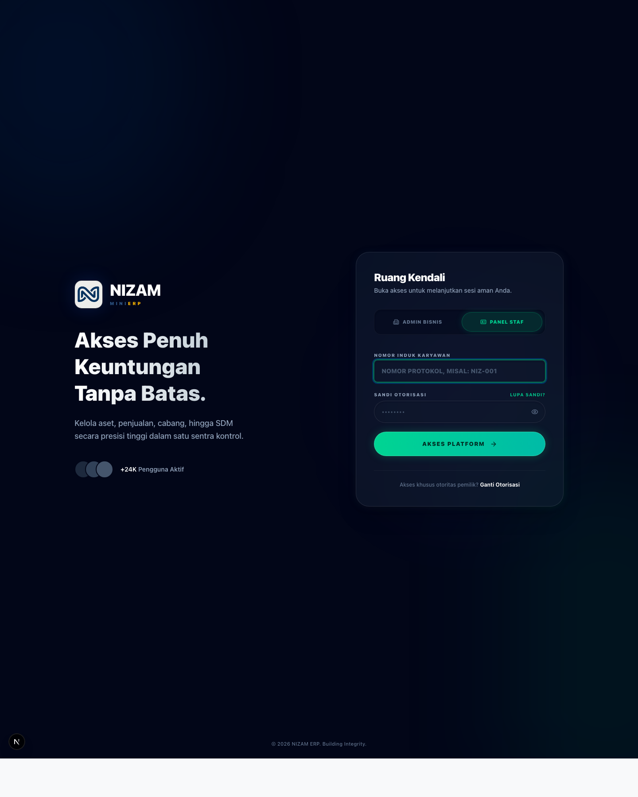
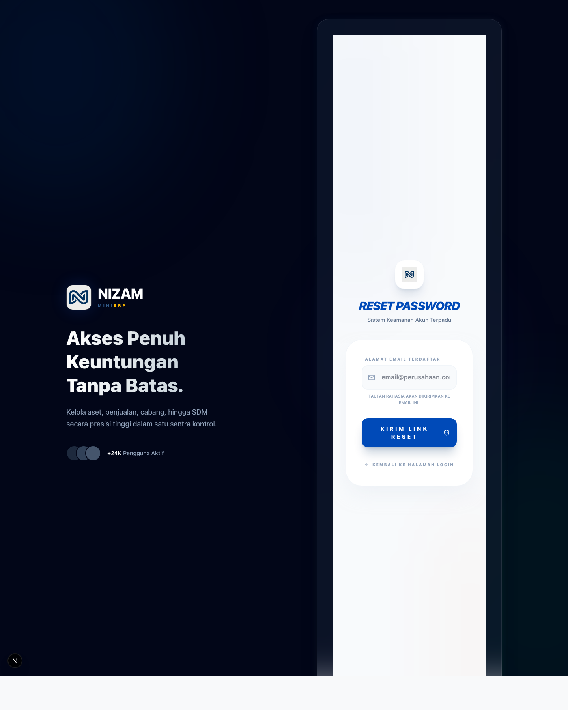

# Buku Kerja Pengguna NIZAM Umum

## Identitas Dokumen

- Nama dokumen: `Buku Kerja Pengguna NIZAM Umum`
- Versi: `1.0`
- Tanggal berlaku: `24 April 2026`
- Fokus: `latihan akses awal ke sistem`

## Cara Menggunakan Buku Kerja Ini

1. Ikuti unit latihan dari atas ke bawah.
2. Gunakan screenshot sebagai acuan bentuk layar.
3. Tandai checklist setelah berhasil.
4. Jika ada error, catat pada kolom hasil.

## Unit Kerja 1. Mendaftar Akun Bisnis Baru

### Tujuan

Peserta mampu membuat akun bisnis baru dengan data yang benar.

### Data Awal Yang Harus Disiapkan

1. nama lengkap pemilik,
2. email bisnis aktif,
3. password minimal 8 karakter.

### Acuan Visual

### Langkah Kerja

1. Buka halaman `Register`.
2. Isi `Nama Lengkap Pemilik`.
3. Isi `Email Koorporasi / Bisnis`.
4. Isi `Create Password`.
5. Klik `Mulai Sekarang — Gratis`.

### Hasil Yang Diharapkan

1. sistem menerima data pendaftaran,
2. pengguna diarahkan ke tahap berikutnya,
3. akun bisnis tercatat dengan email yang diisi.

### Checklist

- [ ] Nama lengkap terisi
- [ ] Email bisnis terisi benar
- [ ] Password minimal 8 karakter
- [ ] Tombol daftar berhasil ditekan

## Unit Kerja 2. Login Sebagai Admin Bisnis

### Tujuan

Peserta mampu masuk ke NIZAM melalui jalur admin bisnis.

### Data Awal Yang Harus Disiapkan

1. email bisnis yang terdaftar,
2. password akun bisnis.

### Acuan Visual

### Langkah Kerja

1. Buka halaman `Login`.
2. Pastikan tab `Admin Bisnis` aktif.
3. Isi `Email Bisnis`.
4. Isi `Sandi Keamanan`.
5. Klik `Inisialisasi Kendali`.

### Hasil Yang Diharapkan

1. sistem memproses otorisasi admin bisnis,
2. pengguna masuk ke langkah berikutnya sesuai status akun.

### Checklist

- [ ] Tab admin bisnis dipilih
- [ ] Email bisnis sesuai
- [ ] Password terisi
- [ ] Tombol login ditekan

## Unit Kerja 3. Login Sebagai Panel Staf

### Tujuan

Peserta mampu masuk ke NIZAM melalui jalur staf.

### Data Awal Yang Harus Disiapkan

1. nomor induk karyawan,
2. password akun staf.

### Acuan Visual

### Langkah Kerja

1. Buka halaman `Login`.
2. Pilih tab `Panel Staf`.
3. Isi `Nomor Induk Karyawan`.
4. Isi `Sandi Otorisasi`.
5. Klik `Akses Platform`.

### Hasil Yang Diharapkan

1. sistem memproses otorisasi staf,
2. pengguna masuk ke area kerja sesuai hak aksesnya.

### Checklist

- [ ] Tab panel staf dipilih
- [ ] Nomor induk karyawan diisi
- [ ] Password staf diisi
- [ ] Tombol akses platform ditekan

## Unit Kerja 4. Melakukan Reset Password Akun Bisnis

### Tujuan

Peserta mampu meminta tautan reset password.

### Data Awal Yang Harus Disiapkan

1. email bisnis yang terdaftar di NIZAM.

### Acuan Visual

### Langkah Kerja

1. Buka halaman `Lupa Password`.
2. Isi `Alamat Email Terdaftar`.
3. Klik `Kirim Link Reset`.
4. Periksa inbox email.

### Hasil Yang Diharapkan

1. sistem menerima permintaan reset,
2. pengguna memperoleh tautan reset atau instruksi lanjutan.

### Checklist

- [ ] Email terdaftar diisi
- [ ] Tombol kirim link reset ditekan
- [ ] Pengguna memahami harus cek email

## Tugas Praktik Mandiri

1. Simulasikan pendaftaran akun bisnis dengan data latihan.
2. Simulasikan login admin bisnis.
3. Simulasikan login panel staf.
4. Simulasikan permintaan reset password.

## Catatan Kesalahan Umum

1. Mengisi email salah format saat pendaftaran.
2. Lupa mengganti tab login.
3. Menggunakan NIK staf di jalur admin bisnis.
4. Menggunakan email yang tidak terdaftar saat reset password.

## Lembar Verifikasi Hasil

| No | Unit kerja | Status | Catatan |
|---|---|---|---|
| 1 | Daftar akun bisnis |  |  |
| 2 | Login admin bisnis |  |  |
| 3 | Login panel staf |  |  |
| 4 | Reset password |  |  |
